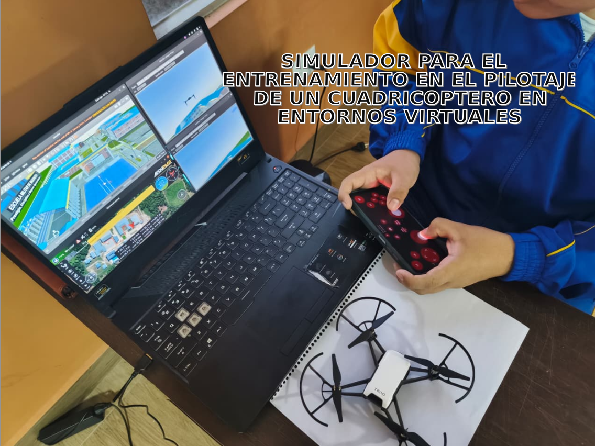
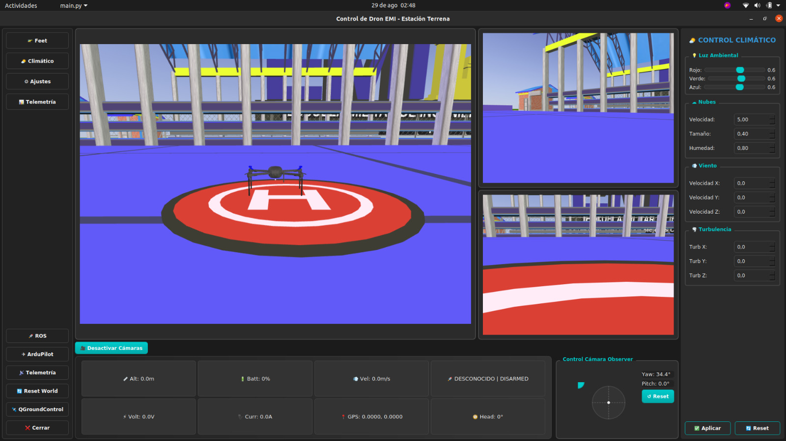
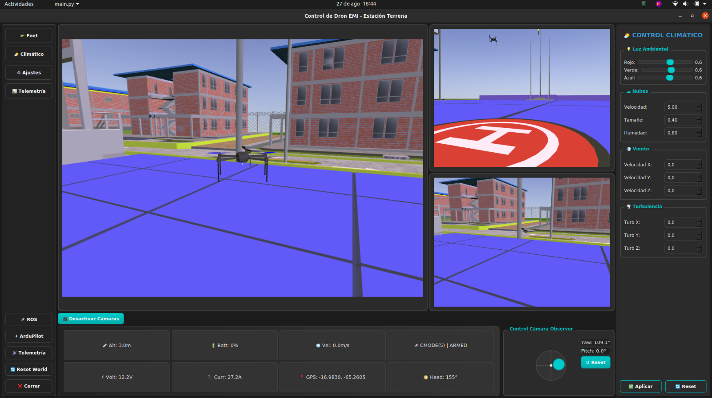

# SIMULADOR PARA EL ENTRENAMIENTO EN EL PILOTAJE DE UN CUADRICOPTERO EN ENTRONOS VIRTUALES
## Proyecto de Trabajo de Grado

## Interfaz Estacion de Control
Simulacion iniciada

## Software Development Tutorials
[Installing Ardupilot and MAVProxy](Install/ArduPillot-20.04.md)

## References 
http://ardupilot.org/copter/index.html

http://ardupilot.org/copter/docs/parameters.html#wpnav-parameters

http://qgroundcontrol.com/

https://discuss.ardupilot.org/

http://ardupilot.org/dev/

https://www.ros.org/
